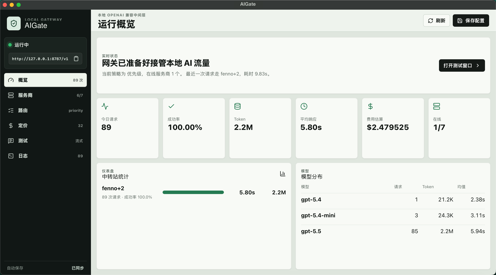

# AIGate

AIGate is a local OpenAI-compatible gateway desktop app. It gives Codex, Continue, Cline, Roo Code, Cherry Studio, Open WebUI, Cursor, and other OpenAI-compatible clients one stable local Base URL, then routes requests to your configured upstream providers.



## What It Does

- Exposes one local OpenAI-compatible endpoint: `http://127.0.0.1:8787/v1`
- Runs the gateway service in Rust
- Provides a Tauri desktop dashboard at `http://localhost:8788` during development
- Forwards `/v1/*` requests to configured provider base URLs
- Supports streaming pass-through for chat and responses APIs
- Retries and fails over on timeout, `429`, and `5xx`
- Tracks provider health, latency, request counts, failures, token usage, cost estimates, and recent logs
- Supports provider priority, fastest, round-robin, and weighted routing strategies

## Architecture

The gateway is maintained in Rust only:

```text
src-tauri/src/gateway
src-tauri/src/bin/aigate-gateway.rs
```

The old Node.js gateway service has been removed from the project. Do not add new gateway logic under `src/gateway`; gateway behavior belongs in `src-tauri/src/gateway`.

The remaining Node tooling is only for the desktop UI build pipeline:

```text
src
vite.config.ts
scripts/build-gateway-sidecar.mjs
```

## Run

Install frontend tooling:

```bash
npm install
```

Run the desktop app and Rust gateway:

```bash
npm run dev
```

Run only the Rust gateway:

```bash
npm run gateway
```

Gateway Base URL:

```text
http://127.0.0.1:8787/v1
```

Dashboard dev URL:

```text
http://localhost:8788
```

## Client Config

Set Codex or any OpenAI-compatible client to:

```text
base_url = "http://127.0.0.1:8787/v1"
```

Use provider API keys in the AIGate dashboard. The gateway replaces inbound authorization with the selected provider key before forwarding requests.

## Configuration

The first run creates:

```text
data/gateway.json
```

You can edit providers in the dashboard or directly in JSON.

Provider shape:

```json
{
  "id": "openrouter",
  "name": "OpenRouter",
  "baseUrl": "https://openrouter.ai/api/v1",
  "apiKey": "sk-xxxxx",
  "apiKeys": [],
  "priority": 2,
  "weight": 60,
  "timeoutMs": 30000,
  "enabled": true,
  "models": ["*"]
}
```

`baseUrl` is used as configured after removing one trailing slash. Include `/v1` only for providers that require it.

## Routing

- `priority`: lowest priority number first
- `fastest`: provider with the best measured latency first
- `round-robin`: rotate enabled providers
- `weighted`: higher weight first

Rules can pin model patterns to provider order:

```json
{
  "id": "gpt-route",
  "pattern": "gpt-*",
  "providerIds": ["polo", "openrouter"],
  "enabled": true
}
```

## Build

Build the Rust sidecar and Tauri app:

```bash
npm run tauri:build
```

Build the UI only:

```bash
npm run build
```

## Project Layout

```text
src/                         React dashboard
src-tauri/src/gateway/       Rust gateway service
src-tauri/src/bin/           Rust gateway binary entry
src-tauri/binaries/          Tauri sidecar binaries
data/                        Local gateway configuration and pricing data
scripts/                     Build helpers for packaging the Rust sidecar
```
